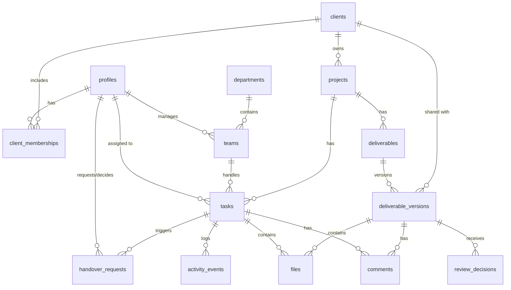

# مخطط قاعدة البيانات (ERD)

```mermaid
erDiagram
    profiles ||--o{ client_memberships : "has"
    profiles ||--o{ teams : "manages"
    profiles ||--o{ tasks : "assigned to"
    profiles ||--o{ handover_requests : "requests/decides"

    departments ||--o{ teams : "contains"
    
    clients ||--o{ client_memberships : "includes"
    clients ||--o{ projects : "owns"

    teams ||--o{ tasks : "handles"

    projects ||--o{ tasks : "has"
    projects ||--o{ deliverables : "has"

    tasks ||--o{ handover_requests : "triggers"
    tasks ||--o{ activity_events : "logs"
    tasks ||--o{ files : "contains"
    tasks ||--o{ comments : "has"

    deliverables ||--o{ deliverable_versions : "versions"
    
    deliverable_versions ||--o{ files : "contains"
    deliverable_versions ||--o{ comments : "has"
    deliverable_versions ||--o{ review_decisions : "receives"
    
    deliverable_versions }o--|| clients : "shared with"

```
